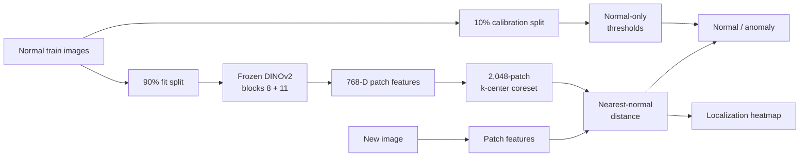

# DINOv2 Industrial Anomaly Detection

> Find and localize manufacturing defects after learning **only from normal
> products**—no defect examples are used for fitting or threshold selection.

[](https://www.python.org/)
[](https://pytorch.org/)
[](https://streamlit.io/)
[](https://www.mvtec.com/research-teaching/datasets/mvtec-ad)

This repository is an end-to-end, one-class visual inspection system built with
a frozen DINOv2 encoder, multi-layer patch features, k-center coreset selection,
and validation-calibrated decisions. It includes reproducible training and
evaluation commands, category checkpoints, automated tests, machine-readable
reports, and an interactive inference dashboard.

## Results at a glance

One configuration was evaluated across **all 15 MVTec AD categories** with zero
failed runs.

| Image AUROC | Image AP | Pixel AUROC | Image F1 |
|:---:|:---:|:---:|:---:|
| **0.9716** | **0.9853** | **0.9647** | **0.9304** |

`Image F1` uses thresholds chosen from held-out **normal validation data**.
Test labels are used only for final evaluation, preventing test-label leakage.

## Why this project is different

- **Real one-class setup:** fitting requires only defect-free images.
- **Explainable output:** every decision includes a score, calibrated threshold,
  anomaly heatmap, and input overlay.
- **Efficient retrieval:** 2,048 representative patch embeddings replace tens
  of thousands of redundant normal patches.
- **Stronger representation:** normalized features from DINOv2 blocks 8 and 11
  combine local detail with higher-level context.
- **Full benchmark:** one command runs every category and exports per-category
  plus macro-average JSON/CSV results.
- **Usable product surface:** the Streamlit dashboard supports all 15 detectors,
  bundled examples, uploads, result downloads, and benchmark inspection.
- **Memory-aware serving:** all categories share one cached DINOv2 encoder; only
  their compact memory banks and thresholds are switched.

## System design



There is no gradient-based fine-tuning. The learned state is a compact memory
bank of normal patch representations plus decision thresholds. At inference,
patches far from their nearest normal neighbor receive higher anomaly scores.

### Deployment memory architecture

The DINOv2 encoder is identical for every category, so the application keeps one
frozen encoder in memory. Each cached category detector references that same
Python/PyTorch object and adds only its approximately 6 MB memory bank plus two
threshold values. Switching categories therefore does not load another copy of
the neural network. The demo also reports the device, total inference time,
per-image latency, and cached detector-access time after each run.

## Try the interactive demo

```bash
python -m venv .venv
source .venv/bin/activate
pip install -r requirements.txt
streamlit run streamlit_app.py
```

Then open the local URL printed by Streamlit. Select a category, choose bundled
samples or upload up to eight images, and click **Analyze images**.

The first launch downloads the official DINOv2 weights through PyTorch Hub.
Published categories also require their matching checkpoint at
`artifacts/all_categories/<category>/detector.pt`.

## Reproduce the experiments

Expected dataset structure:

```text
dataset/archive/<category>/
├── train/good/*.png
├── test/good/*.png
├── test/<defect>/*.png
└── ground_truth/<defect>/*_mask.png
```

Run one category end to end:

```bash
python main.py run --category grid
```

Fit and evaluate separately:

```bash
python main.py fit --category grid --checkpoint artifacts/grid_detector.pt
python main.py evaluate --category grid --checkpoint artifacts/grid_detector.pt
```

Run all 15 categories and create aggregate reports:

```bash
python main.py benchmark \
  --categories all \
  --experiment-dir artifacts/all_categories
```

The aggregate results are written to
`artifacts/all_categories/summary.{json,csv}`. Use `python main.py --help` to
inspect layer, coreset, validation, device, and output options.

## Test your own images

The category must match the fitted checkpoint:

```bash
python test_custom_images.py custom_images/ --category transistor
```

Predictions are printed to the terminal; heatmap overlays and a JSON report are
saved under `custom_predictions/`. Internet images can trigger high scores due
to different cameras, crops, lighting, and backgrounds—an example of domain
shift rather than necessarily a product defect.

## Engineering choices

| Decision | Reason |
|---|---|
| Frozen DINOv2 ViT-S/14 | Strong pretrained visual features without requiring defect labels or expensive fine-tuning |
| Blocks 8 + 11 | Preserve finer local cues while retaining semantic context |
| Approximate greedy k-center | Cover diverse normal patterns while limiting checkpoint size and nearest-neighbor cost |
| 90/10 normal split | Keep threshold calibration independent from memory-bank construction |
| Cosine nearest-neighbor score | Simple, interpretable distance from known-normal patches |
| Top-1% image aggregation | Detect small anomalous regions without letting one noisy patch dominate |

Each 224×224 input produces a 16×16 patch-score grid. It is bilinearly enlarged
for display, so heatmaps are useful for localization but do not provide exact
pixel boundaries for very small defects.

## Repository map

```text
dino_anomaly/                 data, model, inference, and evaluation code
streamlit_app.py              interactive multi-category demo
main.py                       fit, evaluate, run, and benchmark CLI
test_custom_images.py         inference for local images
tests/                        model and Streamlit smoke tests
docs/LEARNING_GUIDE.md        concepts explained from first principles
docs/PORTFOLIO_CASE_STUDY.md  detailed employer-facing case study
```

## Verification

```bash
pip install -r requirements-dev.txt
pytest -q
```

The test suite covers scoring, threshold selection, checkpoint compatibility,
coreset behavior, and headless Streamlit rendering.

## Read more

- [Learning guide](docs/LEARNING_GUIDE.md) — DINOv2, batches, transformer
  blocks, embeddings, coresets, thresholds, heatmaps, and metrics from scratch.
- [Portfolio case study](docs/PORTFOLIO_CASE_STUDY.md) — architecture,
  per-category results, trade-offs, failure analysis, and CV-ready bullets.
- [MVTec sample attribution](docs/MVTEC_SAMPLE_LICENSE.md) — source and license
  details for the bundled non-commercial gallery examples.

## Current limitations and next experiment

The clean MVTec benchmark does not represent every factory camera, lighting
condition, or product revision. The 16×16 token grid also limits fine boundary
localization. The highest-value next experiment is a controlled ablation of
single-layer versus multi-layer features, random versus k-center sampling, and
multiple coreset sizes. That would quantify the accuracy, latency, and storage
trade-offs behind the design instead of relying only on the final configuration.

## Dataset license

MVTec AD is a third-party dataset. The small bundled gallery is included for a
non-commercial educational demonstration under **CC BY-NC-SA 4.0**, with
attribution to MVTec Software GmbH. Review the dataset's terms before deploying
or using this project commercially.
